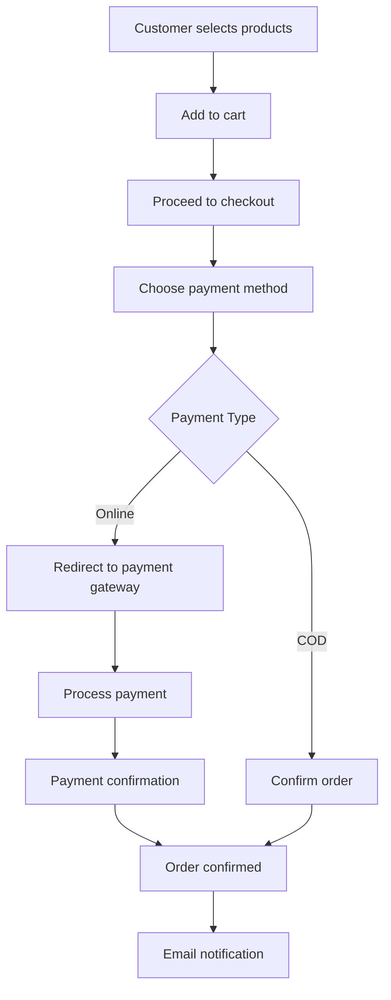

# 7TCC - Sports Fashion E-commerce Platform

<div align="center">
  
  
  [](https://php.net/)
  [](https://mysql.com/)
  [](https://getbootstrap.com/)
  [](https://javascript.info/)
  [](https://ai.google.dev/)
  
  **A modern sports fashion e-commerce platform developed by 8 students from Saigon University**
  
  [🌐 Live Demo](https://web7tcc-a9aaa5d624b4.herokuapp.com/) • [📧 Contact](mailto:zaikaman123@gmail.com) • [🛍️ Shop Now](https://web7tcc-a9aaa5d624b4.herokuapp.com/index.php)
</div>

---

## 📋 Table of Contents

- [🎯 About The Project](#-about-the-project)
- [✨ Features](#-features)
- [🛠️ Built With](#️-built-with)
- [🚀 Getting Started](#-getting-started)
  - [Prerequisites](#prerequisites)
  - [Installation](#installation)
  - [Database Setup](#database-setup)
  - [Configuration](#configuration)
- [💻 Usage](#-usage)
- [🏗️ Project Structure](#️-project-structure)
- [🔌 API Documentation](#-api-documentation)
- [🎨 UI Components](#-ui-components)
- [🤖 AI Integration](#-ai-integration)
- [💳 Payment Integration](#-payment-integration)
- [👥 Contributing](#-contributing)
- [📝 License](#-license)
- [📞 Contact](#-contact)
- [🙏 Acknowledgments](#-acknowledgments)

---

## 🎯 About The Project

**7TCC** is a comprehensive sports fashion e-commerce platform designed and developed by a team of 8 passionate students from Saigon University. The platform specializes in providing high-quality sports apparel and accessories for true sports fans.

### 🌟 Project Vision
To create an intuitive, feature-rich e-commerce experience that combines modern web technologies with AI-powered customer support, making sports fashion accessible to everyone.

### 🎓 Academic Project
This project serves as a capstone project demonstrating:
- Full-stack web development skills
- Database design and management
- AI integration and API consumption
- Payment gateway integration
- Modern UI/UX principles
- Agile development methodologies

---

## ✨ Features

### 🛒 **E-commerce Core**
- **Product Management**: Comprehensive catalog with categories, search, and filtering
- **Shopping Cart**: Persistent cart with session management
- **User Authentication**: Secure registration, login, and profile management
- **Order Management**: Complete order lifecycle from placement to delivery
- **Inventory Tracking**: Real-time stock management
- **Advanced Search**: Multi-criteria product search with autocomplete

### 🤖 **AI-Powered Customer Support**
- **Intelligent Chatbot**: Google Gemini AI integration for customer queries
- **Product Recommendations**: AI-driven product suggestions
- **Order Assistance**: Automated help with order status and policies
- **Multilingual Support**: Vietnamese language optimization

### 💳 **Payment Integration**
- **Multiple Payment Methods**: 
  - Cash on Delivery (COD)
  - Bank Transfer
  - MoMo E-wallet
  - Credit/Debit Cards (Visa, JCB, ATM)
- **Secure Transactions**: Encrypted payment processing
- **Payment Tracking**: Real-time payment status updates

### 🔧 **Admin Panel**
- **Dashboard**: Comprehensive analytics and insights
- **Product Management**: CRUD operations for products and categories
- **Order Management**: Order processing and status updates
- **User Management**: Customer account administration
- **Content Management**: Blog posts and news articles
- **Statistics**: Sales reports and performance metrics

### 🎨 **Modern UI/UX**
- **Responsive Design**: Mobile-first approach with Bootstrap 5
- **Interactive Elements**: Smooth animations and transitions
- **Dark/Light Theme**: User preference-based theming
- **Accessibility**: WCAG compliant design
- **Performance Optimized**: Fast loading times and smooth navigation

### 📱 **Additional Features**
- **Email Notifications**: Automated order confirmations and updates
- **Wishlist**: Save products for later
- **Product Reviews**: Customer feedback system
- **Social Media Integration**: Share products and connect
- **SEO Optimized**: Search engine friendly URLs and meta tags

---

## 🛠️ Built With

### **Backend Technologies**
-  **PHP 8.1+** - Server-side scripting
-  **MySQL 8.0+** - Database management
-  **Composer** - Dependency management

### **Frontend Technologies**
-  **HTML5** - Markup language
-  **CSS3** - Styling and animations
-  **JavaScript ES6+** - Interactive functionality
-  **Bootstrap 5.3** - UI framework
-  **jQuery** - DOM manipulation

### **Third-party Services**
-  **Google Gemini AI** - Chatbot intelligence
-  **MoMo Payment** - E-wallet integration
-  **PHPMailer** - Email services
-  **Carbon** - Date manipulation

### **Development Tools**
-  **Git** - Version control
-  **Heroku** - Cloud deployment
-  **AWS RDS** - Database hosting

---

## 🚀 Getting Started

### Prerequisites

Before you begin, ensure you have the following installed on your system:

```bash
# PHP 8.1 or higher
php --version

# Composer (PHP dependency manager)
composer --version

# MySQL 8.0 or higher
mysql --version

# Node.js (for development tools, optional)
node --version
```

### Installation

1. **Clone the repository**
   ```bash
   git clone https://github.com/yourusername/7tcc-ecommerce.git
   cd 7tcc-ecommerce
   ```

2. **Install PHP dependencies**
   ```bash
   composer install
   ```

3. **Set up environment variables**
   ```bash
   # Copy the configuration files
   cp admincp/config/config.example.php admincp/config/config.php
   cp config_momo.example.json config_momo.json
   ```

4. **Configure web server**
   
   **For Apache (XAMPP/WAMP):**
   ```apache
   <VirtualHost *:80>
       DocumentRoot "/path/to/7tcc-ecommerce"
       ServerName 7tcc.local
       <Directory "/path/to/7tcc-ecommerce">
           AllowOverride All
           Require all granted
       </Directory>
   </VirtualHost>
   ```
   
   **For Nginx:**
   ```nginx
   server {
       listen 80;
       server_name 7tcc.local;
       root /path/to/7tcc-ecommerce;
       index index.php index.html;
       
       location / {
           try_files $uri $uri/ /index.php?$query_string;
       }
       
       location ~ \.php$ {
           fastcgi_pass unix:/var/run/php/php8.1-fpm.sock;
           fastcgi_index index.php;
           fastcgi_param SCRIPT_FILENAME $realpath_root$fastcgi_script_name;
           include fastcgi_params;
       }
   }
   ```

### Database Setup

1. **Create a new MySQL database**
   ```sql
   CREATE DATABASE tcc_ecommerce CHARACTER SET utf8mb4 COLLATE utf8mb4_unicode_ci;
   ```

2. **Import the database schema**
   ```bash
   mysql -u your_username -p tcc_ecommerce < sql.sql
   ```

3. **Update database configuration**
   ```php
   // admincp/config/config.php
   <?php
   $mysqli = new mysqli(
       "your_host",      // Database host
       "your_username",  // Database username
       "your_password",  // Database password
       "tcc_ecommerce",  // Database name
       3306              // Port
   );
   
   if ($mysqli->connect_errno) {
       echo "Failed to connect to MySQL: " . $mysqli->connect_error;
       exit();
   }
   ?>
   ```

### Configuration

1. **Configure MoMo Payment**
   ```json
   {
       "partnerCode": "YOUR_PARTNER_CODE",
       "accessKey": "YOUR_ACCESS_KEY",
       "secretKey": "YOUR_SECRET_KEY"
   }
   ```

2. **Set up Google Gemini AI**
   ```php
   // In api/chat.php, update the API key
   $API_KEY = 'YOUR_GEMINI_API_KEY';
   ```

3. **Configure email settings**
   ```php
   // In mail/sendmail.php
   $mail->Host = 'your-smtp-host.com';
   $mail->Username = 'your-email@domain.com';
   $mail->Password = 'your-email-password';
   ```

4. **Set file permissions**
   ```bash
   chmod 755 admincp/modules/quanLySanPham/uploads/
   chmod 755 admincp/modules/quanLyBaiViet/uploads/
   ```

---

## 💻 Usage

### **Customer Interface**

1. **Browse Products**
   - Visit the homepage to see featured products
   - Use the search bar to find specific items
   - Filter by categories in the sidebar

2. **Shopping Cart**
   - Add products to cart from product pages
   - View cart by clicking the cart icon
   - Proceed to checkout when ready

3. **Account Management**
   - Register for a new account or login
   - View order history and update profile
   - Change password in account settings

4. **AI Chat Support**
   - Click the chat bubble in the bottom right
   - Ask questions about products, policies, or orders
   - Get instant AI-powered responses

### **Admin Interface**

1. **Access Admin Panel**
   ```
   URL: /admincp/
   Default credentials:
   Username: admin
   Password: hello (MD5 hashed)
   ```

2. **Manage Products**
   - Add new products with images and descriptions
   - Update inventory and pricing
   - Organize products into categories

3. **Process Orders**
   - View incoming orders in real-time
   - Update order status and tracking
   - Generate invoices and shipping labels

4. **Analytics Dashboard**
   - Monitor sales performance
   - View customer analytics
   - Track inventory levels

---

## 🏗️ Project Structure

```
7tcc-ecommerce/
├── 📁 admincp/                 # Admin panel
│   ├── 📁 config/              # Database configuration
│   ├── 📁 modules/             # Admin modules
│   │   ├── 📁 quanLySanPham/   # Product management
│   │   ├── 📁 quanLyDonHang/   # Order management
│   │   ├── 📁 quanLyBaiViet/   # Content management
│   │   └── 📁 thongKe/         # Statistics
│   └── 📄 index.php            # Admin dashboard
├── 📁 api/                     # API endpoints
│   └── 📄 chat.php             # AI chat API
├── 📁 css/                     # Stylesheets
│   ├── 📄 style-v1.css         # Main styles
│   ├── 📄 chat.css             # Chat interface styles
│   └── 📄 style.css            # Additional styles
├── 📁 js/                      # JavaScript files
│   ├── 📄 script.js            # Main functionality
│   ├── 📄 chat.js              # Chat functionality
│   └── 📄 ajax-handler.js      # AJAX operations
├── 📁 pages/                   # Frontend pages
│   ├── 📁 main/                # Main content pages
│   ├── 📁 sidebar/             # Sidebar components
│   ├── 📄 header.php           # Site header
│   ├── 📄 footer.php           # Site footer
│   └── 📄 menu.php             # Navigation menu
├── 📁 images/                  # Static assets
├── 📁 mail/                    # Email functionality
│   ├── 📁 PHPMailer/           # PHPMailer library
│   └── 📄 sendmail.php         # Email sender
├── 📁 vendor/                  # Composer dependencies
├── 📄 index.php                # Main entry point
├── 📄 composer.json            # PHP dependencies
├── 📄 sql.sql                  # Database schema
└── 📄 README.md                # This file
```

---

## 🔌 API Documentation

### **Chat API**

**Endpoint:** `POST /api/chat.php`

**Description:** Interact with the AI-powered customer support chatbot.

**Request Body:**
```json
{
    "message": "Tôi muốn tìm áo bóng đá"
}
```

**Response:**
```json
{
    "candidates": [
        {
            "content": {
                "parts": [
                    {
                        "text": "Chào bạn! Tôi có thể giúp bạn tìm áo bóng đá. Chúng tôi có nhiều mẫu áo từ các câu lạc bộ nổi tiếng..."
                    }
                ]
            }
        }
    ]
}
```

**Features:**
- Context-aware responses based on store inventory
- Chat history tracking for logged-in users
- Product recommendations and policy information
- Vietnamese language support

### **Database Schema**

#### **Core Tables**

**tbl_sanpham** (Products)
```sql
CREATE TABLE `tbl_sanpham` (
  `id_sp` int PRIMARY KEY AUTO_INCREMENT,
  `ten_sp` varchar(255) NOT NULL,
  `ma_sp` varchar(100) NOT NULL,
  `gia_sp` decimal(10,0) NOT NULL,
  `so_luong_con_lai` int NOT NULL,
  `tom_tat` text,
  `noi_dung` longtext,
  `hinh_anh` varchar(255),
  `id_dm` int NOT NULL,
  `tinh_trang` int DEFAULT 1
);
```

**tbl_danhmucqa** (Categories)
```sql
CREATE TABLE `tbl_danhmucqa` (
  `id_dm` int PRIMARY KEY AUTO_INCREMENT,
  `name_sp` varchar(255) NOT NULL,
  `thu_tu` int DEFAULT 0
);
```

**tbl_cart** (Shopping Cart)
```sql
CREATE TABLE `tbl_cart` (
  `id_cart` int PRIMARY KEY AUTO_INCREMENT,
  `id_khachhang` int NOT NULL,
  `code_cart` varchar(10) NOT NULL,
  `cart_status` int DEFAULT 1,
  `cart_date` varchar(50),
  `cart_payment` varchar(50),
  `cart_shipping` int DEFAULT 0
);
```

**tbl_chat_history** (AI Chat History)
```sql
CREATE TABLE `tbl_chat_history` (
  `id` int PRIMARY KEY AUTO_INCREMENT,
  `email` varchar(100),
  `message` text NOT NULL,
  `response` text NOT NULL,
  `created_at` timestamp DEFAULT CURRENT_TIMESTAMP
);
```

---

## 🎨 UI Components

### **Responsive Design**
- Mobile-first approach with Bootstrap 5
- Flexible grid system for all screen sizes
- Touch-friendly interface elements

### **Key Components**

**Product Cards**
```html
<div class="product card h-100">
    
    <div class="card-body">
        <h5 class="card-title">Product Name</h5>
        <p class="card-text">Price: 500,000 VNĐ</p>
    </div>
</div>
```

**Chat Interface**
```html
<div class="chat-container">
    <div class="chat-header">
        <span>Chat với AI</span>
        <ion-icon name="close-outline"></ion-icon>
    </div>
    <div class="chat-messages" id="chat-messages"></div>
    <div class="chat-input">
        <input type="text" placeholder="Nhập tin nhắn...">
        <button>Gửi</button>
    </div>
</div>
```

### **Color Palette**
- Primary: `#007bff` (Bootstrap Blue)
- Secondary: `#6c757d` (Bootstrap Gray)
- Success: `#28a745` (Bootstrap Green)
- Danger: `#dc3545` (Bootstrap Red)
- Warning: `#ffc107` (Bootstrap Yellow)

---

## 🤖 AI Integration

### **Google Gemini Integration**

The platform integrates Google's Gemini AI model to provide intelligent customer support through a chat interface.

**Key Features:**
- **Context-Aware Responses**: AI understands store inventory and policies
- **Product Recommendations**: Intelligent suggestions based on user queries
- **Order Support**: Automated assistance with order-related questions
- **Policy Information**: Instant access to store policies and procedures

**Implementation:**
```php
// AI prompt construction with store context
$initialPrompt = "Bạn là trợ lý AI của 7TCC - Thương hiệu thời trang thể thao...
Thông tin về cửa hàng:
- Website: https://web7tcc-a9aaa5d624b4.herokuapp.com/
- Địa chỉ: 273 An Dương Vương – Phường 3 – Quận 5
- Hotline: 0909888888
...";

// API call to Gemini
$url = "https://generativelanguage.googleapis.com/v1beta/models/gemini-pro:generateContent?key=" . $API_KEY;
```

**Chat History Management:**
- Persistent chat history for registered users
- Context retention across conversations
- Privacy-focused data handling

---

## 💳 Payment Integration

### **Supported Payment Methods**

1. **MoMo E-wallet**
   - QR code payments
   - Deep link integration
   - Real-time transaction status

2. **Traditional Banking**
   - ATM cards
   - Credit cards (Visa, Mastercard, JCB)
   - Bank transfers

3. **Cash on Delivery (COD)**
   - Pay upon delivery
   - No online transaction required

### **Security Features**
- SSL encryption for all transactions
- PCI DSS compliance
- Secure API endpoints
- Transaction logging and monitoring

### **Payment Flow**


---

## 👥 Contributing

We welcome contributions from the community! Here's how you can help:

### **Getting Started**

1. **Fork the repository**
2. **Create a feature branch**
   ```bash
   git checkout -b feature/amazing-feature
   ```
3. **Make your changes**
4. **Commit your changes**
   ```bash
   git commit -m 'Add some amazing feature'
   ```
5. **Push to the branch**
   ```bash
   git push origin feature/amazing-feature
   ```
6. **Open a Pull Request**

### **Development Guidelines**

**Code Style:**
- Follow PSR-12 coding standards for PHP
- Use meaningful variable and function names
- Comment complex logic and algorithms
- Maintain consistent indentation (4 spaces)

**Database Changes:**
- Always create migration scripts
- Update the schema documentation
- Test with sample data

**Frontend Development:**
- Follow Bootstrap conventions
- Ensure mobile responsiveness
- Test across different browsers
- Optimize for performance

**Testing:**
- Test all new features thoroughly
- Verify existing functionality isn't broken
- Test payment flows in sandbox mode
- Validate form inputs and error handling

### **Bug Reports**

When reporting bugs, please include:
- Clear description of the issue
- Steps to reproduce
- Expected vs actual behavior
- Screenshots if applicable
- Browser and system information

### **Feature Requests**

For new features:
- Describe the feature and its benefits
- Provide use cases and examples
- Consider the impact on existing users
- Suggest implementation approaches

---

## 📝 License

This project is licensed under the MIT License - see the [LICENSE.md](LICENSE.md) file for details.

```
MIT License

Copyright (c) 2024 7TCC Team - Saigon University

Permission is hereby granted, free of charge, to any person obtaining a copy
of this software and associated documentation files (the "Software"), to deal
in the Software without restriction, including without limitation the rights
to use, copy, modify, merge, publish, distribute, sublicense, and/or sell
copies of the Software, and to permit persons to whom the Software is
furnished to do so, subject to the following conditions:

The above copyright notice and this permission notice shall be included in all
copies or substantial portions of the Software.

THE SOFTWARE IS PROVIDED "AS IS", WITHOUT WARRANTY OF ANY KIND, EXPRESS OR
IMPLIED, INCLUDING BUT NOT LIMITED TO THE WARRANTIES OF MERCHANTABILITY,
FITNESS FOR A PARTICULAR PURPOSE AND NONINFRINGEMENT. IN NO EVENT SHALL THE
AUTHORS OR COPYRIGHT HOLDERS BE LIABLE FOR ANY CLAIM, DAMAGES OR OTHER
LIABILITY, WHETHER IN AN ACTION OF CONTRACT, TORT OR OTHERWISE, ARISING FROM,
OUT OF OR IN CONNECTION WITH THE SOFTWARE OR THE USE OR OTHER DEALINGS IN THE
SOFTWARE.
```

---

## 📞 Contact

### **7TCC Team**
- **Email**: [zaikaman123@gmail.com](mailto:zaikaman123@gmail.com)
- **Phone**: 0909888888
- **Address**: 273 An Dương Vương – Phường 3 – Quận 5, Ho Chi Minh City
- **Website**: [https://web7tcc-a9aaa5d624b4.herokuapp.com/](https://web7tcc-a9aaa5d624b4.herokuapp.com/)

### **Social Media**
- [🐦 Twitter](https://twitter.com/7tcc_official)
- [📘 Facebook](https://facebook.com/7tcc.official)
- [📷 Instagram](https://instagram.com/7tcc_official)
- [🎥 YouTube](https://youtube.com/c/7tcc)

### **Academic Institution**
**Saigon University**
- Computer Science Department
- Final Year Project 2024
- Supervisor: [Professor Name]

---

## 🙏 Acknowledgments

We extend our heartfelt gratitude to:

### **Academic Support**
- **Saigon University** - For providing the educational foundation and project guidance
- **Computer Science Department** - For technical mentorship and resources
- **Project Supervisor** - For invaluable guidance throughout development

### **Technology Partners**
- **Google** - For Gemini AI API access and documentation
- **MoMo** - For payment gateway integration and testing environment
- **Heroku** - For reliable cloud hosting services
- **AWS** - For database hosting and infrastructure

### **Open Source Community**
- **Bootstrap Team** - For the excellent UI framework
- **PHPMailer** - For robust email functionality
- **Carbon** - For elegant date/time handling
- **jQuery** - For simplified JavaScript operations

### **Design and Assets**
- **Ionicons** - For beautiful interface icons
- **Google Fonts** - For typography resources
- **Unsplash/Pexels** - For stock photography

### **Testing and Feedback**
- **Beta Testers** - Fellow students and faculty who provided valuable feedback
- **Local Sports Community** - For domain expertise and user experience insights
- **Family and Friends** - For continuous support and encouragement

### **Special Recognition**
This project represents the culmination of our computer science education and demonstrates the practical application of theoretical knowledge in real-world scenarios. We're proud to contribute to the e-commerce ecosystem while showcasing Vietnamese talent in technology.

---

<div align="center">
  
  **⭐ If you find this project helpful, please give it a star! ⭐**
  
  Made with ❤️ by the 7TCC Team at Saigon University
  
  *"For True Fans Since 2024"*
  
  ---
  
  
  
  
  
</div>